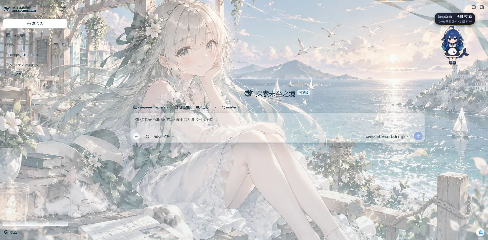
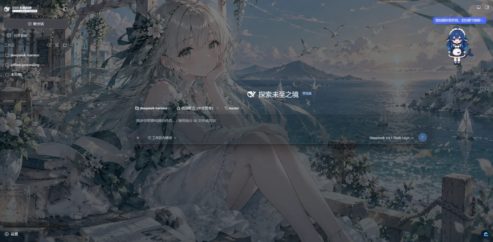
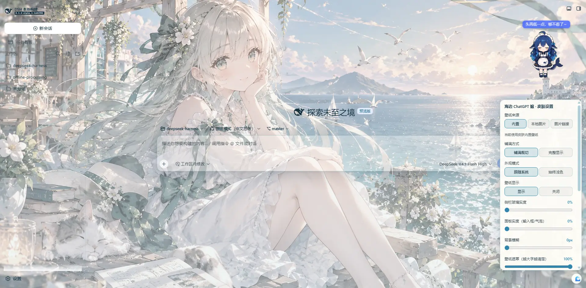

# 海边 ChatGPT 娘 · dsh-skin-beach-chatgpt

> DeepSeek Harness Web GUI 的**整页壁纸皮肤插件**：一张 4K 海边壁纸铺满界面，
> 侧栏 / 顶栏 / 输入器 / 用户气泡改为玻璃拟态面板，亮暗主题各自套用「晨光海面」与「暮色海面」两套色板。

| 亮色主题 | 暗色主题 |
| --- | --- |
|  |  |

**简体中文** ｜ [English](README.en.md)

---

## 特性

- **整页壁纸**：4K 原图压成 2560×1440 WebP 后**内联进插件产物**，激活不依赖任何临时文件、远程 URL 或静态资源服务器。
- **亮 / 暗双色板**：跟随官方主题（`body[data-ds-dark-theme]`）自动切换，海蓝 × 落日橙的强调色在两种主题下各自校正过对比度。
- **整页一体的背景图**：壁纸只在 body 上画一次（`fixed` + `cover`），每个布局列都透明，从左栏到对话区是同一张连续的图，不会在列与列之间被切成几块。
- **不碰 DSH 的弹层**：设置弹框、菜单、toast、代码块用到的语义 token 与层叠上下文全部保持官方行为——皮肤不覆盖它们的底色，也不在承载弹层的容器上加 `backdrop-filter`（那会把弹框压回容器所在的那一层）。
- **亮暗双主题**：亮色是「晨光海面」，暗色是「暮色海面」（同一张壁纸压暗成暮色，界面层换深色玻璃）。面板里的**外观模式**可选**跟随系统**（默认，亮暗都提供）或**始终浅色**（摘掉宿主的暗色标记，让 DSH 也走亮色分支，避免"浅色壁纸 + 深色弹框"的混搭）。
- **只改颜色，不改布局**：不触碰 `display` / 网格 / 尺寸，因此侧栏宽度联动、工作台推挤、窗口缩放都不受影响。
- **卸载即复原**：所有写入都注册为 Cordis effect 还原器，插件停用后 body 属性与 `theme-color` 自动回到原值。
- **自带设置面板**：右下角悬浮入口（<kbd>Alt</kbd>+<kbd>B</kbd> 开合），可调玻璃实度、模糊、壁纸遮罩、文字颜色、强调色；**壁纸可换**——内置图 / 本地图片 / 图片链接三选一，改完即时生效并存进浏览器本地存储。
- **纯展示层**：不注册服务、不发 Cordis 事件、不读写会话数据、不触碰模型请求。

## 目录结构

```
dsh-skin-beach-chatgpt/
├── package.json              # 包清单：dsh.bundle.patch + dsh.client 声明
├── cordis.patch.yml          # 名册层：把浏览器插件行插入 profile 配置树
├── skin.json                 # 皮肤元数据（供皮肤管理器/皮肤中心识别）
├── lib/
│   ├── index.js              # host 侧入口（空实现，纯展示层插件）
│   └── client.js             # 浏览器产物（构建生成，已随仓库提交）
├── src/client/
│   ├── skin.css              # 皮肤样式表（唯一表现层真相）
│   ├── panel.js              # 自带设置面板 + 设置读写（ESM 源码）
│   └── apply.js              # 浏览器侧挂载逻辑（ESM 源码）
├── tests/smoke.mjs           # jsdom 行为冒烟测试（测产物而不是源码）
├── scripts/
│   ├── build.mjs             # 零依赖构建：CSS + 壁纸 + 脚本 → lib/client.js
│   └── configure.mjs         # 零依赖安装配置器（由 install 脚本调用）
├── assets/
│   ├── wallpaper-2560.webp   # 皮肤壁纸（构建内联用）
│   └── wallpaper-1920.webp   # 低分辨率备选（弱机型可切换）
├── preview/                  # 预览图
├── install.sh / install.ps1  # 一键安装（Linux/macOS · Windows）
└── uninstall.sh / uninstall.ps1
```

## 环境要求

| 项 | 要求 |
| --- | --- |
| DeepSeek Harness | ≥ 0.1.2（`web` profile，即 `dsh web` 启动的 GUI） |
| Node.js | ≥ 20（仅安装/构建时需要） |
| pnpm | ≥ 9（profile 依赖由 pnpm 管理） |

## 安装

三种方式任选其一。安装完成后都需要**重启一次 DSH**（`dsh web` 进程重启或桌面端重新打开）——profile 的 bundle 层在启动时组合，新增插件无法在运行中热插拔。

### 方式 A：一键脚本（推荐）

**Windows（PowerShell）**

```powershell
# 在插件目录内执行
powershell -ExecutionPolicy Bypass -File .\install.ps1
```

**macOS / Linux**

```sh
chmod +x install.sh && ./install.sh
```

脚本会依次完成：

1. 定位 `$DSH_HOME`（默认 `~/.dsh`）与要安装的 profile（默认 `web`，可用 `-Profile` / `DSH_PROFILE` 指定）；
2. 把插件目录复制到 `$DSH_HOME/plugins/dsh-skin-beach-chatgpt`；
3. 备份并更新 profile 的 `package.json`（`dependencies` + `dsh.profile.bundles`）；
4. 清除 `node_modules` 中的旧拷贝并执行 `pnpm install`；
5. 默认执行**皮肤互斥**（见下一节），可用 `-SkipExclusive` / `--skip-exclusive` 关闭；
6. 打印重启提示。

### 方式 B：`dsh plugin`（从 GitHub 直装）

`dsh` 自带插件管理命令，它把参数转发给 profile 目录里的 pnpm，并按安装结果自动把声明了 `dsh.bundle` 的依赖加进 `dsh.profile.bundles`：

```sh
# 从 GitHub 直装（作者仓库：lingstudy-J/dsh-skin-beach-chatgpt）
dsh plugin --profile web add github:lingstudy-J/dsh-skin-beach-chatgpt
```

```powershell
# Windows PowerShell：git 形式的 spec 建议加引号
dsh plugin --profile web add 'github:lingstudy-J/dsh-skin-beach-chatgpt'
```

> 桌面端（`dsh --profile desktop`）把 `web` 换成 `desktop` 即可。
> 本插件不需要在安装时构建（`lib/` 已随仓库提交），因此不会触发 pnpm 的依赖构建脚本拦截。

### 方式 C：手工接入（本地目录 / 二次开发）

```sh
# 1. 复制插件
cp -r dsh-skin-beach-chatgpt "$DSH_HOME/plugins/"     # Windows: %USERPROFILE%\.dsh\plugins\
```

```sh
# 2. 编辑 ~/.dsh/profiles/web/package.json
```

```jsonc
{
  "dependencies": {
    "dsh-client-ui-skin-beach-chatgpt": "file:../../plugins/dsh-skin-beach-chatgpt"
  },
  "dsh": {
    "profile": {
      "bundles": [
        "@deepseek-ai/dsh-base",
        "@deepseek-ai/dsh-web-app",
        "dsh-client-ui-skin-beach-chatgpt"
      ]
    }
  }
}
```

```sh
# 3. 安装依赖（cwd 必须是 profile 目录）
cd "$DSH_HOME/profiles/web" && pnpm install
```

```sh
# 4. 校验组合结果：应当能看到 ui-skin-beach-chatgpt 这一行
dsh web --dump-config | grep -A2 ui-skin-beach-chatgpt
```

## 默认应用与皮肤互斥

本插件一旦进入 `dsh.profile.bundles`，它的行就是**启用**状态，即默认生效——这正是"默认应用该皮肤"的含义。

但皮肤是整页级别的覆盖：若同时启用另一套 DSH 皮肤插件（例如 `ui-skin-maid-atelier`），两套样式会叠加。因此安装脚本默认执行一次互斥处理：在 `$DSH_HOME/cordis.patch.yml` 末尾维护一个带标记的区段，把**其它** DSH 皮肤行置为 `disabled: true`（标记区段之外的用户内容一字不动）：

```yaml
# >>> dsh-skin-beach-chatgpt exclusive >>>
- id: ui-skin-maid-atelier
  disabled: true
# <<< dsh-skin-beach-chatgpt exclusive <<<
```

想手工切换、或不想动自动处理时：

- 只想启用本皮肤：`install.ps1 -SoloSkin` 已是默认行为；手工删除区段内的行即恢复其它皮肤。
- 想同时用「皮肤中心」（`@linxin666/dsh-client-ui-skin-center`）：请在该皮肤中心里切回**官方默认**，否则两层整页背景会重叠。安装脚本默认会把 `$DSH_HOME/skin-center-active.json` 的 `active` 清空并备份为 `.bak-<时间戳>`（`-SkipExclusive` 可跳过）。
- 临时停用本皮肤而保留安装：在 `$DSH_HOME/cordis.patch.yml` 写

  ```yaml
  - id: ui-skin-beach-chatgpt
    disabled: true
  ```

## 验证安装成功

重启 DSH 后，在浏览器里打开 GUI（默认 <http://127.0.0.1:3080>），然后：

1. 页面应立即显示海边壁纸，侧栏与输入框呈半透明玻璃质感；
2. 打开 DevTools 控制台：

   ```js
   document.body.hasAttribute('data-dsh-beach-chatgpt')            // → true
   !!document.querySelector('style[data-plugin-css="dsh-client-ui-skin-beach-chatgpt/skin.css"]')  // → true
   ```

3. 切换官方亮/暗主题（设置 → 通用 → 外观），配色应随主题在海蓝（亮）与暮色（暗）之间切换。

## 卸载

```powershell
powershell -ExecutionPolicy Bypass -File .\uninstall.ps1
```

```sh
chmod +x uninstall.sh && ./uninstall.sh
```

卸载脚本会：从 profile 的 `dependencies` 与 `dsh.profile.bundles` 里移除本插件、删除 home patch 中的互斥区段（并按需还原 `skin-center-active.json` 备份）、清理 `node_modules` 拷贝，最后执行一次 `pnpm install`。重启后界面回到官方外观。

## 皮肤设置面板

皮肤自带一个设置面板，不需要额外安装任何东西。

如图：



**入口**：右下角 🌊 悬浮按钮，或 <kbd>Alt</kbd>+<kbd>B</kbd>。**首次安装（本地还没有设置记录）时面板会自动展开一次**，之后不再打扰。入口按钮恒定显示（曾经有过"隐藏入口"的开关，那是个自锁陷阱：藏起入口后就只剩快捷键，而且它挨着滑杆，拖动时很容易被误触）。改动即时生效，并写进浏览器 `localStorage`（键 `dsh-skin-beach-chatgpt:settings:v2`），刷新后保留。

| 设置项 | 取值 | 默认 | 说明 |
| --- | --- | --- | --- |
| 壁纸来源 | 内置 / 本地图片 / 图片链接 | 内置 | 见下表 |
| 铺满方式 | 铺满裁切 / 完整显示 | 铺满裁切 | `cover` 裁边但铺满；`contain` 完整显示但可能留边 |
| **外观模式** | 跟随系统 / 始终浅色 | 跟随系统 | 跟随系统时亮暗都提供；"始终浅色"会摘掉宿主的暗色标记，让 DSH 也走亮色分支（卸载时原样放回） |
| 壁纸显示 | 显示 / 关闭 | 显示 | 关掉后只剩配色与玻璃，弱机型可用 |
| 侧栏玻璃实度 | 0% – 100% | **0%** | 默认完全透明——左侧栏不额外糊一层颜色，壁纸从侧栏到对话区是一整张图；想要玻璃质感再往右推 |
| 面板实度 | 30% – 100% | 88% | 用户气泡、工具栏等的不透明度（输入框有独立一档，见下行） |
| **输入框实度** | 80% – 100% | **97%** | 输入卡片浮在会话滚动区之上；默认接近不透明，**往上滚历史时输入框文字被穿透、看不清就调这个** |
| 背景模糊 | 0 – 32 px | 20 px | 只作用于用户气泡——承载官方弹框/菜单的容器一律不加模糊，否则弹框会被压回容器所在那一层；调 0 等于取消磨砂 |
| 壁纸遮罩 | 0 – 100% | 100% | 壁纸之上的那层薄雾；**字看不清就往上调** |
| 文字颜色 | 冷墨 / 暖褐 / 高对比 | 冷墨 | 预设档，亮暗主题各有一套取值；下面两个取色器一旦动过就切到"自定义"档 |
| **自定义文字颜色 · 浅色主题** | 任意 `#RRGGBB` | `#14303f` | 取色器点一下即切到"自定义"档，也可以直接填十六进制；次级/三级文字色按同一色相自动派生 |
| **自定义文字颜色 · 深色主题** | 任意 `#RRGGBB` | `#eaf3f8` | 与浅色**分开存**：暗色下界面会整体压暗，同一个颜色不可能在两边都清楚 |
| **正文底衬** | 0 – 80% | 0% | 在会话正文下面垫一层玻璃底。**文字和它背后的画面撞色、看不清时，先推这个** |
| 文字阴影 | 开 / 关 | 开 | 极轻的描边阴影，把字从杂乱画面里拎出来（亮色主题配白晕、暗色主题配黑影） |
| 强调色 | 海蓝 / 落日 / 薄荷 / 樱粉 | 海蓝 | 影响链接、焦点框、滑杆、品牌色 |

### 字看不清怎么办

壁纸是照片，局部亮暗不可控，撞色是必然会遇到的情况。按这个顺序试：

1. **正文底衬**往上推（20–40% 通常就够）——只在会话正文下面垫一层玻璃，不影响"背景一体"的观感；
2. 换 **文字颜色**预设，或用**取色器**挑一个和画面明度差得开的颜色——亮色与深色**各有一个取色器**，分别保存：暗色下界面整体压暗，同一个颜色不可能在两边都清楚；
3. 打开 **文字阴影**（默认已开）；
4. 都不满意时再抬 **壁纸遮罩**——它是全局的，会影响整幅画。

正文颜色现在有显式基线：`[data-chat-flow]`、markdown 容器与用户气泡都会落到 `var(--beach-ink)`，不再只依赖语义 token 的间接映射。

### 换壁纸

三种来源，改完立刻生效，**不需要重新构建、不需要重启**：

1. **内置**：仓库自带的 `assets/wallpaper-2560.webp`（构建时内联进产物）。想换掉默认那张，替换该文件后重新构建即可。
2. **本地图片**：在面板里选"本地图片"→ 挑一张图。插件会在浏览器里把它缩放到最长边 2560px 并转成 WebP（质量 0.82）再存进本地存储 —— 这一步是必须的，原样保存 4K 原图会立刻撞上 localStorage 的 5MB 配额。图片过大时面板会提示"已应用但不会保留"。
3. **图片链接**：填入图片直链（`https://…`）后点"应用链接"。只接受 `http(s)://` 与 `data:image/`，其它协议一律拒绝。跨域图片由浏览器直接当 CSS 背景加载，不受画布同源策略影响。

"恢复默认"按钮会一次性还原上表全部设置（含壁纸回到内置）。

## 自定义（改源码）

### 配色方案（青灰系）

色相取自壁纸里那条灰绿色丝带 —— 正文用深灰青而非纯黑，强调用低饱和青绿而非高饱和蓝，在照片背景上都不会"跳"出来。全部集中在 `src/client/skin.css` 顶部的变量里，亮暗各一段：

| 用途 | 变量 | 亮色 | 暗色 |
| --- | --- | --- | --- |
| 正文主文字 | `--beach-ink` | `#26383A` | `#E8EDEC` |
| 标题 / 强调文字 | `--beach-ink-strong` | `#17292C` | `#FFFFFF` |
| 次级文字（时间、描述） | `--beach-ink-soft` | `#52686A` | `#B6C4C3` |
| 弱化文字（placeholder、状态） | `--beach-ink-faint` | `#78898A` | `#8FA0A0` |
| 链接 / 链接 hover | `--beach-link` / `--beach-link-hover` | `#2E716C` / `#225B58` | `#A8D5CE` / `#C6E6E1` |
| 主题强调（按钮、选中态、图标） | `--beach-sea` | `#527C75` | `#8FBDB4` |
| 浅强调背景（hover、标签、选中） | `--beach-accent-soft` | `#DCEAE6` | `rgba(82, 124, 117, 0.34)` |
| 边框 | `--beach-line` | `rgba(55, 86, 87, 0.20)` | `rgba(148, 190, 186, 0.24)` |
| 面板玻璃基色 | `--beach-glass-rgb` | `250 249 246` | `20 32 34` |
| 代码文字 | `--beach-code-ink` | `#F3F0E8` | `#F3F0E8` |
| 代码块底 | `--dsw-alias-markdown-code-block` | `rgba(28, 40, 42, 0.92)` | `rgba(12, 20, 21, 0.92)` |

标题、链接、代码用的是专门规则（`--beach-ink-strong` / `--beach-link` / `--beach-code-ink`），不再只靠语义 token 的间接映射。

**换内置壁纸**：替换 `assets/wallpaper-2560.webp`（建议 2560×1440、WebP 质量 80 左右，控制在 500 KiB 内），然后重新构建：

```sh
node scripts/build.mjs                                   # 默认用 2560 版本
node scripts/build.mjs --art=assets/wallpaper-1920.webp  # 弱机型：内联更小的图
```

生成 2560×1440 WebP 的一种方式（需要 Python + Pillow）：

```sh
python -c "from PIL import Image; im=Image.open('原图.png').convert('RGB'); im.thumbnail((2560,1440)); im.save('assets/wallpaper-2560.webp','WEBP',quality=80,method=6)"
```

**改配色**：编辑 `src/client/skin.css` 顶部的 `--beach-*` 变量（两套主题各一段），再重新构建。所有颜色都集中在文件开头，其余规则只引用变量。

**降低渲染开销**：不需要磨砂时，把面板里的「背景模糊」拉到 0 即可（该旋钮只作用于用户气泡——承载官方弹框的容器一律不加模糊）；壁纸与配色仍然保留。

## 工作原理

```
profile package.json
  └─ dsh.profile.bundles: [..., dsh-client-ui-skin-beach-chatgpt]
        └─ 本包 package.json 声明 dsh.bundle.patch → cordis.patch.yml
              └─ cordis.patch.yml 插入行 { id: ui-skin-beach-chatgpt, name: dsh-client-ui-skin-beach-chatgpt }
                    ├─ host 侧：lib/index.js 的空 apply()（占位，保证 entry 可挂载）
                    └─ client 侧：package.json 的 dsh.client 让 DSH 把 lib/client.js
                       作为浏览器 entry 送达；它调用 window.__ModuleLoader__.load({ id, factory })
                       惰性注册工厂，物化时注入 <style>，并由 Cordis 调用导出的 apply(ctx)。
```

皮肤本体只做三件事：注入一份作用域限定在 `body[data-dsh-beach-chatgpt]` 的样式表、给 `body` 打上该属性、按主题同步 `theme-color`。卸载时全部还原。

## 常见问题

**Q：重启后界面没变化？**
按顺序检查：`dsh web --dump-config | grep ui-skin-beach-chatgpt` 是否有该行；`~/.dsh/profiles/web/node_modules/dsh-client-ui-skin-beach-chatgpt` 是否存在（`pnpm install` 是否真的跑在该 profile 目录）；浏览器是否强刷（Ctrl/Cmd+Shift+R）。

**Q：壁纸显示不完整 / 被裁切？**
壁纸以 `cover` 铺满视口，宽高比不同于屏幕时一定会裁边。想让画面主体居中，请用构图居中的图片；想减少裁切，把 `src/client/skin.css` 里的 `background-size: cover, cover` 改成 `contain, contain` 并给 `background-color` 一个接近画面边缘的颜色。

**Q：为什么宿主端 `index.js` 是空的？**
这是纯展示层插件的正常形态：它不需要 host 服务，但 DSH 的 profile 装载器需要一个可挂载的 entry，浏览器半由同一包的 `dsh.client` 声明送达。

**Q：切到深色后有些文字像"消失"了？**
暗色分支的文字是近白的，而这张壁纸是**白天的海面**：遮罩太轻、玻璃太透时，浅色文字就会淹没在明亮背景里，界面看上去像空了一样。暗色分支因此把遮罩调重（0.52–0.70）并给侧栏/顶栏加了更厚的深色玻璃（0.34）。如果你手动把「壁纸遮罩」拉到很低，暗色下会重新出现这个现象——想彻底避开，就把「外观模式」选成**始终浅色**。

**Q：往上滚历史内容时，输入框里的字被背景文字糊住了？**
输入卡片浮在会话滚动区之上，半透明就会让滚上来的历史文字从卡片里透出来。默认已把它压到 97% 不透明（暗色 94%）；如果还不够（比如"面板实度"被调得很低，或壁纸本身对比很强），把面板里的「输入框实度」推到 100% 即可彻底断开。

**Q：会影响模型、工具或会话数据吗？**
不会。插件没有 host 行为、不注册服务、不参与任何 RPC。它对页面的全部影响都写在 `src/client/skin.css` 里。

## 作者

**shiwu** · GitHub [@lingstudy-J](https://github.com/lingstudy-J) · 仓库 [lingstudy-J/dsh-skin-beach-chatgpt](https://github.com/lingstudy-J/dsh-skin-beach-chatgpt)

问题、建议与皮肤投稿请走仓库的 Issues / Pull Requests。Fork 之后要换成自己的署名，改这几处即可：`package.json` 的 `author`、`repository`、`homepage`、`bugs` 与 `dsh.repo`，以及 `skin.json` 的 `author`（`skin.json` 的 `package` 是包名，与 `package.json` 的 `name` 保持一致即可）。

## 许可与素材来源

- **代码**：MIT，见 [LICENSE](LICENSE)。
- **美术资源**（`assets/`、`preview/`）：本仓库自带的壁纸为二次创作素材，权利归原作者所有，**仅限自用与非商业分享，不可商用**；再分发请保留此说明。仓库使用者如替换为自己的图片，请同步更新本节与 `LICENSE` 的美术说明。
